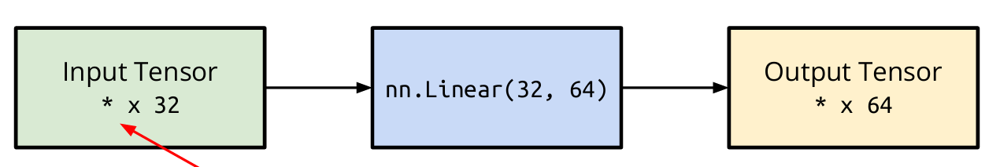

//前面Intro的部分等待笔记搬运……
#### Step 2: Use PyTorch to build model
用PyTorch定义神经网络。以最简单的线性层为例：
`nn.Linear(in_features, out_features)`


这个32x64的线性神经网络（注意，这里定义的是fully-connected layer），实际上就是64x32的参数矩阵


```python
>>> layer = torch.nn.Linear(32, 64)
>>> layer.weight.shape
torch.Size([64, 32])
>>> layer.bias.shape
torch.Size([64])
```

需要override PyTorch对nn的initialization：
```python
#Build your own neural network
class MyModel(nn.Module)
	def __init__(self):
		super(MyModel, self).__init__()
		self.net = nn.Sequential(
			nn.Linear(10,32), #initialize and build your own model
			nn.sigmoid(),
			nn.Linear(32,1)
		)
	def forward(self, x)
		return self.net(x) #compute output of your own NN
```
上面的代码等价于：
```python
import torch.nn as nn 
class MyModel(nn.Module): 
	def __init__(self): 
		super(MyModel, self).__init__() 
		self.layer1 = nn.Linear(10, 32) 
		self.layer2 = nn.Sigmoid(), 
		self.layer3 = nn.Linear(32,1) 
	def forward(self, x): 
		out = self.layer1(x) 
		out = self.layer2(out) 
		out = self.layer3(out) 
		return out
```

#### Step 3: Use PyTorch to train and test
用PyTorch里的内置方法进行损失函数的表达：
- Mean Squared Error (for regression tasks) 
	`criterion = nn.MSELoss()` 
- Cross Entropy (for classification tasks) 
	`criterion = nn.CrossEntropyLoss()` 
- Loss Function
	`loss = criterion(model_output, expected_value)`