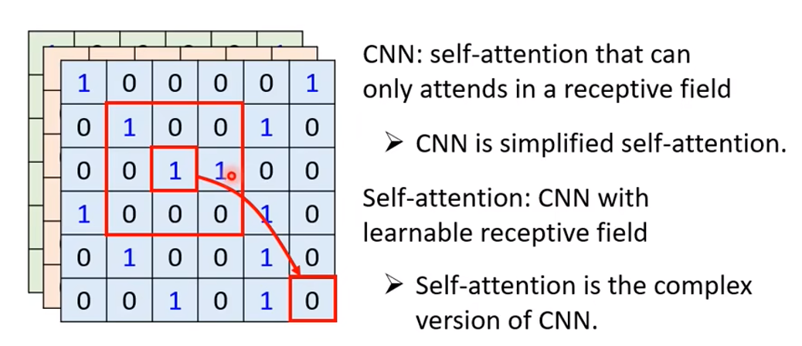
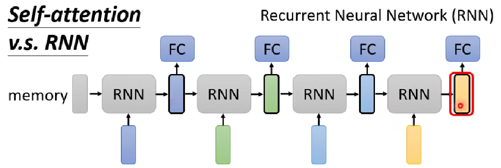
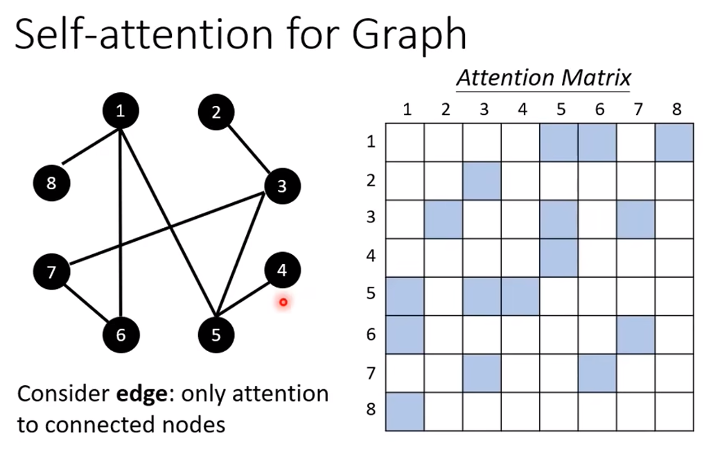

（前面的部分已记录在Notes里，后续补上，后面主要是讲self-attention structure的变体）

### Postion Encoding
每一个row/column，人为指定一个向量作为该位置的特征向量，在进行self-attention结构运算的时候，作为additive factor加入运算。
Position encoding的生成方式有各式各样的，具体的论文里有叙述。
- Sinusoid
- Positional embedding
- FLOATER
- RNN

### Self-Attention for Speech
对于语音识别来说，一段完整的语音序列长度可能非常长。
Speech is a very long vector sequence. If the length of sequence is L, the complexity of the self-attention matrix is square(L).
需要非常大的内存进行相关的运算，可能不容易训练。

Truncated Self-Attention
在做self-attention的时候，我们不做整个sequence范围上的self-attention运算，而是做规定范围内的（truncated sequence self-attention）。

### Self-Attention for Image
An image can also be considered as a vector set, and it could be very large too. 
做CNN的时候，我们将图片视为一条非常长的向量。

CNN vs Self-Attention
]
Self-Attention的receptive field is "learned", not set mannually.

RNN - Recurrent Neural Network

很多RNN的应用，其实用self-attention module也能做。
但是RNN的限制之处在于，不同输入vector的关联性运算**不能并行进行**。

### Self-Attention for Graph
Consider edge: only attention to connect nodes.

Node_1和Node_5/6/7相连，所以只用计算他们之间的attention分数。
Graph本身往往是人为根据某些domain knowledge计算出来的。