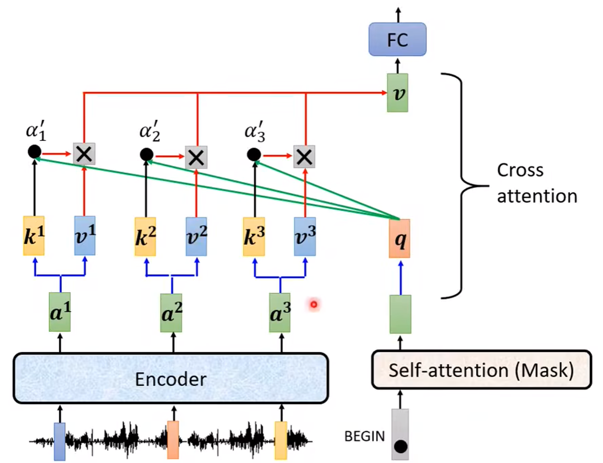

Transformer和Bert模型之间很有关系。

什么是Tranformer?
Sequence to sequence model - it is called transformer. It inputs a sequence and output a sequence. The output length is determined by the model.

有怎样的应用会用到这种Seq2Seq呢？
- Speech Recognition - 语音辨识（语音信号 -> 文字）
- Machine Translation - 机器翻译
- Speech Translation - 语音翻译

上一章讲了encoder，今天讲decoder.

Autoregressive Decoder
- 输入输出流：开始的时候有一个BEGIN token，接下来每一次的输出，都会当作下一次的输入，依次产生序列。可能会有error propagation的问题。
- 总结构：
	- 小结构：Mask self-attention. 就是在做一套self-attention计算的时候，只考虑左边已有的输入（vector component）之间的关联性。
- Decoder如何自主决定输出序列的长度？Autoregressive的运作方式，可以无限的输入-输出下去，所以需要一个特别的表示“断”的符号，即END token。在训练的时候，需要decoder在输入序列的结尾的时候输出END.

Non-Autoregressive Decoder
只需要一个步骤，就能完成序列的生成。

Cross-attention module

Decoder中途的输出，会跟Encoder的中间值进行一个attention的计算，就叫做cross attention.

Encoder - Decoder Training
给语音（序列）信号进行文字（序列）标注，label as the ground truth.
Minimize the cross-entropy of ground truth and output distribution, kinda like Classification.

Decoder训练的时候，输入给的是ground truth而不是encoder给的输出。This is called Teacher Forcing.

Training tips:
- Copy mechanism：复读机制。
- Guided attention