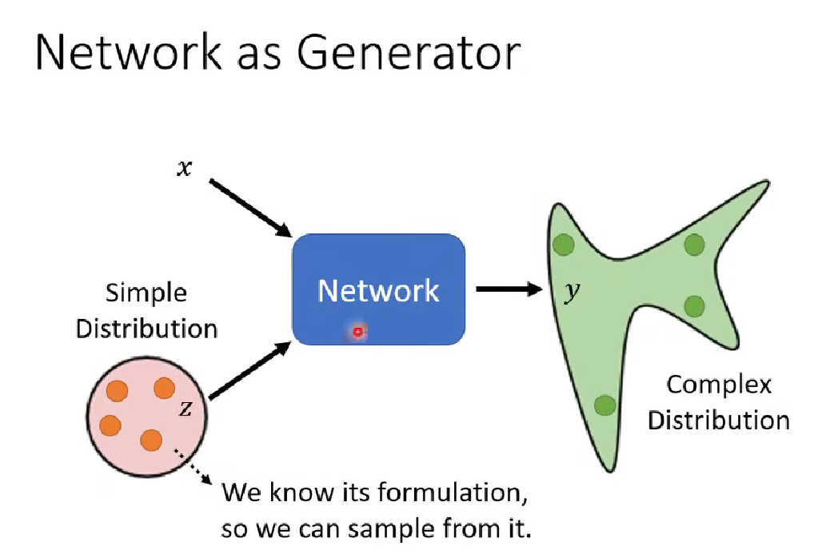
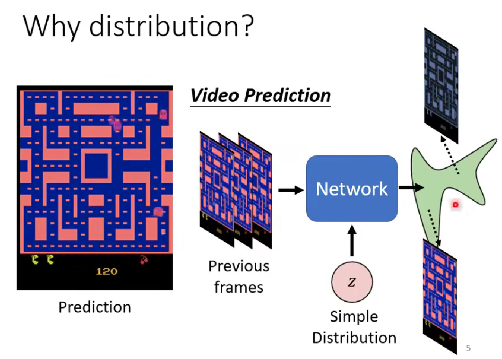
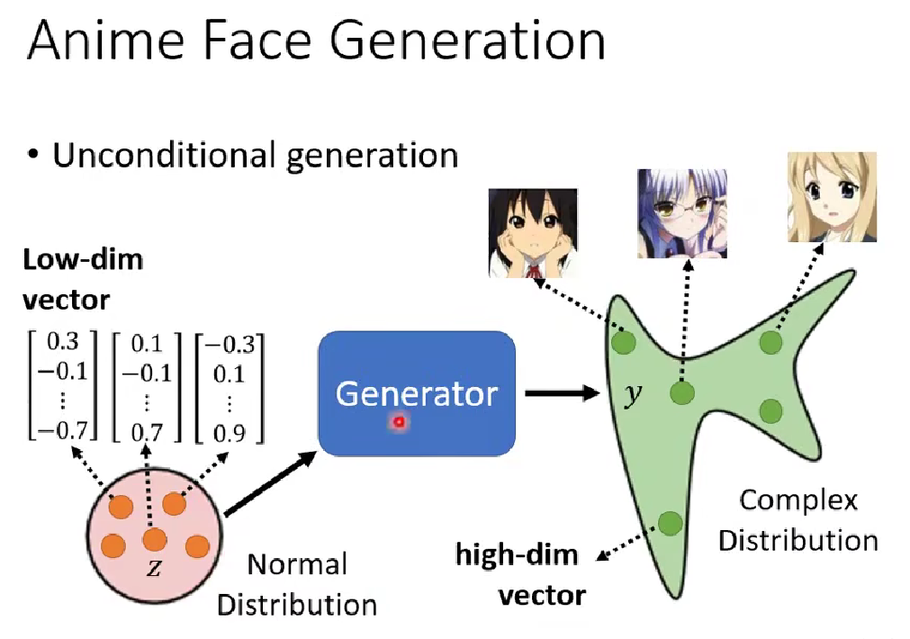
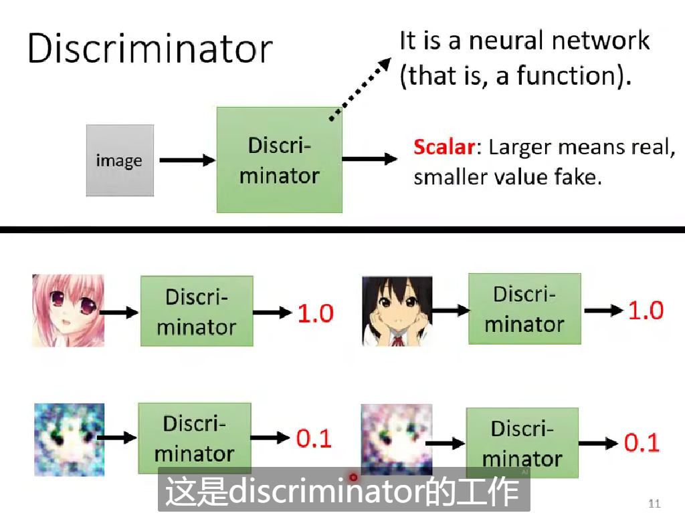

# Network as Generator

Input (x) + Simple Distribution (z) -> Network -> Output (y)

z是从一个（简单）分布里sample出来的，we know its formulation so we can sample from it.

Sample的值不同，得到的输出就不一样。

为什么我们需要generator？为什么输出有的时候需要是一个分布？
“有两种可能性的数据，同时存在训练资料里”，此时需要让机器的输出是带“机率”的。

- Especially for tasks need "creativity" - 输出的值有多种的“可能性”
- The same input could result in different output

Generative Models
生成式的模型中比较知名的一个就是GAN（Generative Adversarial Network，对抗式生成模型）。

# GAN

Unconditional Generation
- Input (x) 
	- Unconditional generator没有输入x
- Simple Distribution (z) 
	- 通常选择低维的向量，服从正态分布
	- Low-dim vector, ~normal distribution
- Output (y)
	- Generator需要对z进行升维。
	- Output z is of complex distribution, and of high-dim vector.

在GAN里面需要额外训练的模块：Discriminator

## Discriminator

拿图片作为输入，输出是一个数值。Discriminator本身也是一个neural network（架构完全可以由自己设计）.
输出数值越大，说明输入越像是一个真的二次元头像。

## Basic Idea of 
GAN进行生成的过程：
第一代的Generator - 参数完全随机 - 第一代的Discriminator进行评分
![[Pasted image 20250414221822.png]]

