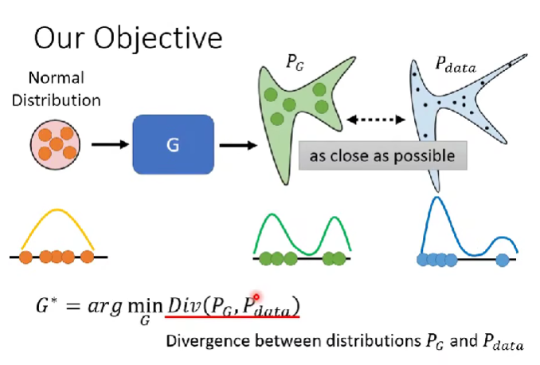
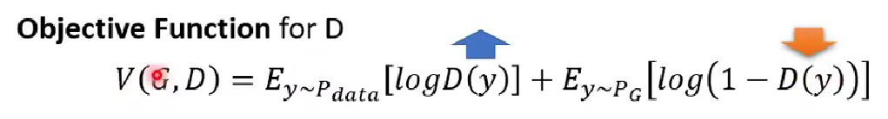

Theory behind GAN

Our Objective
Normal Distribution -> G -> P_g -> P_data
We aim to minimize the divergence of between distribution P_g and P_data

Ideal Generator G*

如何计算P_g和P_data分布的divergence? 这两个分布的表达式都是未知的，所以我们只能采用采样的方式。Sampling is good enough......

Instead of using real divergence function, we use Objective Function instead, to optimize (the parameter of) Discriminator:

